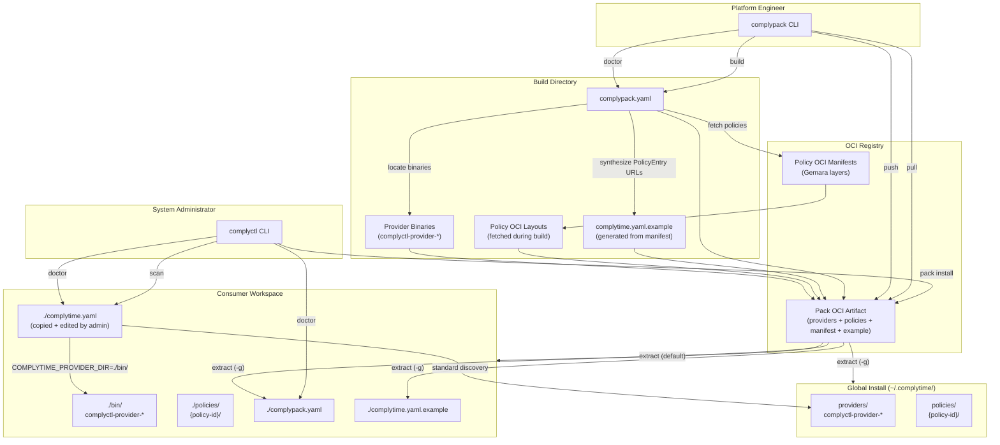

# Implementation Plan: Comply-Packs

**Branch**: `002-comply-packs` | **Date**: 2026-02-27 | **Spec**: [spec.md](./spec.md)
**Input**: Feature specification from `specs/002-comply-packs/spec.md`
**Prerequisite**: `001-gemara-native-workflow` (complete)

## Summary

Add a comply-pack distribution mechanism to ComplyTime. Two binaries, two personas. `complypack` (new, `cmd/complypack/`) is a standalone CLI for platform engineers to build, validate, push, and pull OCI-based compliance packs. `complyctl pack install` (new subcommand) is for admins to pull and extract packs into their workspace. A pack is a single OCI manifest with typed layers: provider binaries, pre-cached policy OCI layouts, `complypack.yaml` manifest, and a generated `complytime.yaml.example`. Custom media types (`application/vnd.complytime.pack.*`) identify each layer. Each pack targets a single `os`/`arch` pair — `complyctl pack install` validates host compatibility before extracting (multi-arch via OCI Index deferred). The pack builder reads `complypack.yaml` (existing `PackManifest` struct from `internal/complytime/pack.go`), fetches policies via `oras-go/v2`, locates provider binaries on the local filesystem, synthesizes `complytime.yaml.example` using the `PolicyEntry{url, id}` format from 001, and assembles the OCI artifact. Distribution is OCI-only — airgap handled by `skopeo copy` to/from `oci-archive`. `complyctl pack install` supports workspace-local (default: `./bin/`, `./policies/`) and global (`-g`: `~/.complytime/providers/`, `~/.complytime/policies/`) extraction. One pack per workspace — installing a second pack replaces the first (overwrite prompt or `--force`). If install fails mid-extraction, all written files are rolled back. `COMPLYTIME_PROVIDER_DIR` env var overrides provider discovery path for workspace-local installs. `complyctl doctor` gains pack-awareness: when `complypack.yaml` is present, validates pack integrity (binaries, caches, system deps via `check` commands with documentation `url` for remediation) alongside standard config checks. Doctor is advisory only — does not block `generate` or `scan`. Zero changes to `complyctl` runtime for non-pack users.

## Data Flow Diagram



## Technical Context

**Language/Version**: Go 1.24
**Primary Dependencies** (existing):
- `oras.land/oras-go/v2` v2.6.0 — OCI manifest assembly, push, pull, layer extraction
- `oras.land/oras-credentials-go` (latest) — Docker credential resolution (shared with `complyctl`)
- `github.com/spf13/cobra` — CLI framework (shared with `complyctl`)
- `github.com/goccy/go-yaml` — YAML serialization for manifest and example config

**New Dependencies**: None. All required OCI operations are supported by `oras-go/v2`.

**Shared Types**: `internal/complytime/pack.go` (`PackManifest`, `PlatformConfig`, `PackPolicyEntry`, `PackProviderEntry`, `SystemDependency`), `internal/complytime/config.go` (`WorkspaceConfig`, `PolicyEntry`, `SaveTo()`, `ParsePolicyRef()`), `internal/complytime/consts.go` (existing + new pack media type constants). `RegistryConfig` removed — each `PackPolicyEntry` carries its own `url`.

**Storage**:
- Build: Temporary OCI Layout dirs during policy fetch, assembled artifact in working directory
- Install: Workspace-local (`./bin/`, `./policies/`) or global (`~/.complytime/providers/`, `~/.complytime/policies/`)

**Testing**: `go test` with `testify`. Integration tests with `cmd/mock-oci-registry/` for push/pull. E2E: build → push → install → doctor → scan roundtrip.

**Constraints**:
- Zero custom auth code (reuses `oras-credentials-go`)
- Single-platform packs with `os`/`arch` in manifest; install validates host compatibility (multi-arch deferred, R2)
- No custom tarball format — OCI-only distribution
- `complypack` binary shares `internal/` types — must live in this repo
- Pack is a delivery mechanism, not a runtime mode — zero changes to `complyctl` scan/generate behavior
- One pack per workspace; second install replaces first (overwrite prompt or `--force`)
- Install rollback on failure — no partial installs
- Doctor is advisory only — no enforcement gate for `generate`/`scan`

**Research References**: [research.md](./research.md) — R1 (media types), R2 (multi-arch + platform validation), R3 (OCI structure), R4 (CLI framework), R5 (`COMPLYTIME_PROVIDER_DIR`), R6 (example config generation), R7 (install layout), R8 (doctor pack checks + advisory model)

## Constitution Check

*GATE: Must pass before Phase 0 research. Re-check after Phase 1 design.*

| Principle | Status | Evidence |
|:---|:---|:---|
| I. Single Source of Truth | **PASS** | `complypack.yaml` = authoritative pack contents. Types shared via `pack.go` — no duplication. Example config generated from manifest fields (R6). New media type constants in `consts.go` (R1). Platform `os`/`arch` declared once in manifest, validated at install time via `runtime.GOOS`/`runtime.GOARCH` |
| II. Simplicity & Isolation | **PASS** | `complypack` = separate binary, single concern (build/push/pull). `complyctl pack install` = thin OCI pull + extract with platform check and rollback. Doctor pack checks in dedicated `checkPack()` function — advisory only. No changes to existing `complyctl` commands |
| III. Incremental Improvement | **PASS** | 002 is additive to 001. NFR-201: zero changes to `complyctl` runtime for non-pack users. Pack types already exist in 001 data model. Doctor advisory model preserves existing behavior |
| IV. Readability First | **PASS** | Explicit naming: `BuildPackArtifact`, `ExtractPackLayer`, `GenerateExampleConfig`, `MediaTypePackProvider`. Layer routing by media type is self-documenting. Rollback logic tracks written files explicitly |
| V. Do Not Reinvent the Wheel | **PASS** | OCI for distribution (not custom tarball). `oras-go` for push/pull. `skopeo` for airgap. `cobra` for CLI. `runtime.GOOS`/`runtime.GOARCH` for platform detection. Zero new dependencies |
| VI. Composability | **PASS** | `complypack build` → registry → `complyctl pack install` → standard `complyctl` workflow. Each tool does one thing. Pack output feeds directly into existing 001 pipeline. Doctor output is consumable diagnostics, not a gate |
| VII. Convention Over Configuration | **PASS** | `complypack.yaml` presence triggers pack-aware doctor. `COMPLYTIME_PROVIDER_DIR` is the only env var override. One pack per workspace (no merge logic). Sensible defaults for install paths. `--force` opt-in for overwrite |

## Project Structure

### Documentation (this feature)

```text
specs/002-comply-packs/
├── plan.md              # This file
├── spec.md              # Feature specification
├── research.md          # R1-R8 decisions
├── data-model.md        # Entity definitions
├── quickstart.md        # Usage guide
└── tasks.md             # Task breakdown (pending)
```

### Source Code (new + modified)

```text
cmd/
├── complypack/                      # NEW — separate binary
│   ├── main.go                      # Entry point
│   └── cli/
│       ├── root.go                  # CLI root + subcommand registration
│       ├── build.go                 # complypack build (FR-201)
│       ├── push.go                  # complypack push (FR-202)
│       ├── pull.go                  # complypack pull (FR-203)
│       └── doctor.go               # complypack doctor (FR-204)
├── complyctl/
│   └── cli/
│       └── pack.go                  # NEW — complyctl pack install (FR-205)

internal/
├── complytime/
│   ├── consts.go                    # MODIFIED — add pack media type constants, EnvProviderDir
│   ├── config.go                    # MODIFIED — RegistryConfig removed (unused after pack schema change)
│   ├── pack.go                      # MODIFIED — Registry field removed from PackManifest; PackPolicyEntry gains url field
│   └── workspace.go                 # UNCHANGED
├── doctor/
│   └── doctor.go                    # MODIFIED — add checkPack() for pack-layer diagnostics (FR-207)
├── pack/                            # NEW — pack assembly and extraction
│   ├── artifact.go                  # OCI artifact assembly (BuildPackArtifact)
│   ├── extract.go                   # Layer extraction (ExtractPackArtifact)
│   ├── example_config.go           # Example config generation (GenerateExampleConfig)
│   ├── policy_fetch.go             # Policy fetch into OCI Layout dirs
│   └── install.go                   # Install path resolution, platform validation, rollback (FR-205/211/212)
├── registry/
│   ├── client.go                    # UNCHANGED
│   └── auth.go                      # UNCHANGED (shared by complypack)

pkg/
└── plugin/
    └── discovery.go                 # UNCHANGED (caller provides resolved path)
```

### Modified Existing Files

| File | Change | Reason |
|:---|:---|:---|
| `internal/complytime/config.go` | Remove `RegistryConfig` type (no longer used) | Schema simplification |
| `internal/complytime/pack.go` | Remove `Registry` field from `PackManifest`; add `URL` field to `PackPolicyEntry`; update validation | Multi-registry packs |
| `internal/complytime/consts.go` | Add pack media type constants, `EnvProviderDir`, `ExampleConfigFile`, `PackBinDir`, `PackPoliciesDir` | Constitution I: centralize constants |
| `internal/complytime/consts.go` | Modify `ResolvePluginDir()` to check `COMPLYTIME_PROVIDER_DIR` env var | FR-206 |
| `internal/doctor/doctor.go` | Add `checkPack()` function for pack-layer diagnostics | FR-207 |
| `Makefile` | Add `build-complypack` target | Build automation |
| `go.mod` | No changes expected — all dependencies already present | — |

### Workspace Files (with comply-pack installed)

```text
workspace/
├── bin/
│   └── complyctl-provider-*         # Provider binaries (workspace-local install)
├── policies/
│   └── {policy-id}/                 # OCI Layout dirs (untarred from pack)
├── complypack.yaml                  # Pack manifest (extracted from pack)
├── complytime.yaml.example          # Starter config (extracted from pack)
└── complytime.yaml                  # Runtime config (admin-created from example)
```

## Complexity Tracking

No constitution violations. All gates pass. Complexity is bounded:
- `complypack` CLI has 4 commands (build, push, pull, doctor) — no routing, no plugin management
- `complyctl pack install` is a single command with one flag (`-g`), plus platform validation (FR-211), overwrite prompt / `--force` for single-pack semantics, and rollback on failure (FR-212)
- Doctor pack checks add one function to existing diagnostic pipeline — advisory only, no enforcement gate
- `COMPLYTIME_PROVIDER_DIR` is a single env var check in one function
- Install rollback tracks written files during extraction and removes them on error — standard cleanup pattern
